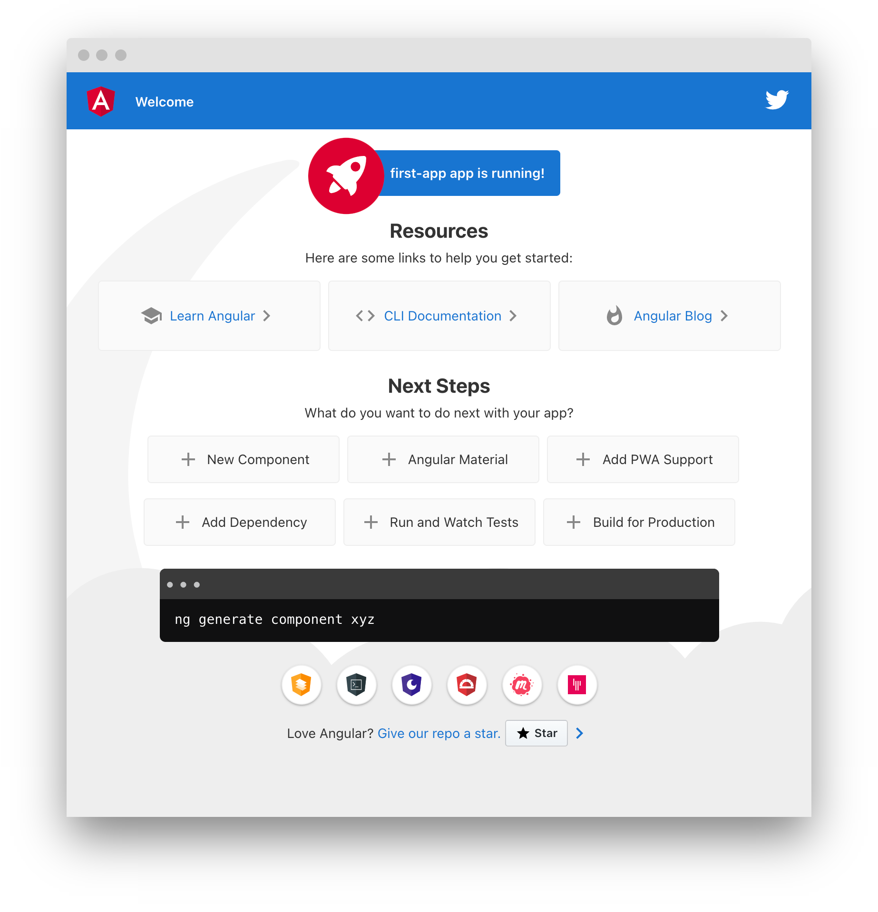

Angular 是一個前端框架，可用於簡單、複雜、精緻的頁面使用，以下範例使用 Angular 10。

想要使用 Angular，建議對於 HTML、Javascript、CSS 有一定的暸解。

<!--more-->

# 本機安裝

將介紹使用 Angular CLI 的方式安裝。

## 環境前置作業

@angular/cli v10.0.0 版本要求：
* node >= 10.13.0
* npm >= 6.11.0

查看目前 @angular/cli 版本：`npm ls @angular/cli -g`

### Node.js

可於 [官網](https://nodejs.org/en/) 中下載最新或 LTS 版本來安裝。

查看目前 Node.js 版本：`node -v`

### npm

安裝好 Node.js 時會自動安裝 npm，而這是一個套件管理的工具。

查看目前 npm 版本：`npm -v` 

## 安裝 Angular CLI

需使用 npm 來安裝 Angular CLI，輸入以下命令來進行安裝。


npm i -g @angular/cli


## 建立應用程式

建立一個應用程式開始學習 Angular。

1. 使用 `ng new` 的指令加上應用程式名稱(這裡使用 first-app)來建立：


ng new first-app


2. 執行後詢問是否新增 Angular routing 路由設定？ 可選擇預設的 y


? Would you like to add Angular routing? (y/N)


3. 接續會詢問你使用的 CSS 為哪一種? 可選擇預設的 CSS 即可


? Which stylesheet format would you like to use?
❯ CSS
  SCSS   [ https://sass-lang.com/documentation/syntax#scss                ]
  Sass   [ https://sass-lang.com/documentation/syntax#the-indented-syntax ]
  Less   [ http://lesscss.org                                             ]
  Stylus [ http://stylus-lang.com                                         ]


## 執行應用程式

可以使用 Angular CLI 直接在本機架設伺服器，方便本機開發。


-- 進入剛剛新增的應用程式資料夾
cd first-app

-- 啟動伺服器
ng serve


啟動完成後，進入 http://localhost:4200/ 顯示如下圖，代表環境安裝成功囉！

